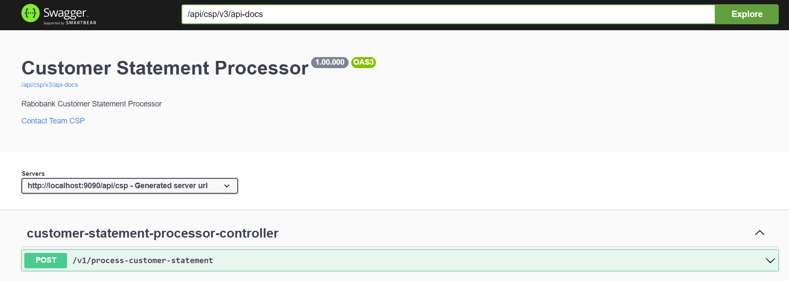

# Customer Statement Processor #

# Description # 

  Rabo Bank receives monthly deliveries of customer statement records. 
  This information is delivered in two formats i.e., CSV and XML.
  These records need to be validated based on below conditions :
  
    * All Transaction References should be unique in the whole monthly statement.
    * End balance needs to be validated.(End Balance must be equal to Start Balance +/- Mutation)
  
  After validation, it returns a generated report which contains both the Transaction Reference and Description of each of the failed records.

## Technology Stack

- Java 17
- SpringBoot
- JUnit 5

## Pre-requisite

- Java 17
- Maven
- Git bash ( Or any of your favourite IDE from where you can connect to git)

## Steps to run the application

- Checkout the code / Download from git repo(https://github.com/Parthasarathi-Sahoo/csp.git)
- Checkout : open git bash and run command `git clone https://github.com/Parthasarathi-Sahoo/csp.git`
- Open command prompt(cmd)
- Go inside the project folder
- Run command `mvn clean install`
- After successful build run command `mvn spring-boot: run` to start the app.

Now application should be up and running and available at : `http://localhost:9090/api/csp/v1/process-customer-statement`

The Swagger Open API documentation of the API can be found at : `http://localhost:9090/api/csp/swagger-ui/index.html`

##### Alternative

* Import the project in one of your favourite IDE
* Run the file `src/main/java/com/rabo/csp/CustomerStatementProcessorApplication.java`

## Quick run

* The API can be reached at http://localhost:9090/api/csp/v1/process-customer-statement
* Upload the csv or xml file as 'inputFile' attribute in POST body

## Code quality

* SonarQube scan: Code quality scanned with sonarlint plugin

## Assumption and Consideration
* The API can process one file per each request . It can be either in CSV or XML format but not both in a single request.
* The end validation result will be presented in CSV file format

## Scope for improvement

* The final validation result could be generated in user requested file format.
* Extend support for handling special character encoding.
